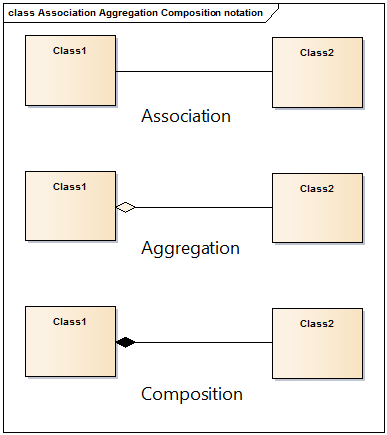

Semana 14: Unidad 4
=====================

Actividades
-------------

Actividad 5
^^^^^^^^^^^^
* Fecha: octubre 6 de 2020 - 8 a.m.
* Descripción: ejercicios de la unidad 4
* Recursos: ingresa al grupo de Teams
* Duración de la actividad: 1 hora 40 minutos de discusión
* Forma de trabajo: colaborativo con solución de dudas en tiempo real.

La semana pasada te comenté que cuando DISEÑAS un programa orientado a objetos
también debes considerar las relaciones entre esos objetos. Pues bien, en general
hay dos tipos:

* Relaciones TO-HAVE o HAS-TO (TIENE UN)

* Relaciones TO-BE o IS-A (ES UN) (¿recuerdas la herencia?)

Vamos a concentrarnos primero en las TO-HAVE: la composición y la agregación.

Ejercicio 1
##############
¿Qué es una relación de composición? 

Dos objetos tienen una relación de composición cuando uno de ellos contiene a
otro objeto. Debes tener en cuenta que en una relación de composición la VIDA del objeto
contenido depende de la vida del objeto contenedor, es decir, 
si el objeto contenedor muere, el objeto contenido también. Cuando el objeto
contenedor se va destruir, primero tendrá que hacerse con el objeto contenido.

Mira de nuevo este código:

.. code-block:: c 
   :linenos:

    #include "queue.h"
    #include <stdlib.h> 

    static void init(queue_t* this, int size) {
        this->front = 0;
        this->rear = 0;
        this->arr = (double*)malloc(size * sizeof(double));
    }

    queue_t* create(int size){
        queue_t* q = malloc(sizeof(queue_t));
        init(q,size);
        return(q);
    }

Observa la función ``create``. Dicha función crear una ``queue``.
¿Qué datos componen la cola?

.. code-block:: c 
   :linenos:

    typedef struct {
        int front;
        int rear;
        double* arr;
    } queue_t;

    #endif

A su vez se en ``init`` estamos creando un nuevo objeto que no es más
que un arreglo de ``size`` ``doubles``. La relación entre estos dos objetos
es de composición.  

Ahora nota que al momento de destruir el objeto contenedor, primero se
destruye el objeto contenido:

.. code-block:: c 
   :linenos:

    void destroy(queue_t* this){
        free(this->arr);
        free(this);
    }

Ejercicio 2
##############
¿Qué es la agregación?

En esta relación tenemos también un objeto contenedor y un objeto contenido, la
gran diferencia con la composición es que la vida del objeto contenido no depende
de la vida del objeto contenedor. El objeto contenido puede ser construido incluso
antes de que el objeto contenedor sea construido.

MINI-RETO
##############
Con todo lo anterior en mente y esta nueva definición, te tengo un mini RETO:

Implementa un programa en C modelado con objetos que implemente una relación de
agregación para esta situación: " ...el jugador recoge un arma, la usa varias veces 
y luego la tira..."

.. note::
    ¡Alerta de Spoiler!

    Una posible implementación a este mini-reto la puedes ver en el siguiente código
    tomado de `este <https://www.packtpub.com/free-ebook/extreme-c/9781789343625>`__ 
    . Le hice unas pequeñas modificaciones al código para que puedas ver el resultado
    en la terminal.

gun.h:

.. code-block:: c 
   :linenos:

	#ifndef GUN_H_
	#define GUN_H_
	
	typedef int bool_t;
	
	// Type forward declarations
	struct gun_t;
	
	// Memory allocator
	struct gun_t* gun_new();
	
	// Constructor
	void gun_ctor(struct gun_t*, int);
	
	// Destructor
	void gun_dtor(struct gun_t*);
	
	// Behavior functions
	bool_t gun_has_bullets(struct gun_t*);
	void gun_trigger(struct gun_t*);
	void gun_refill(struct gun_t*);
	
	
	#endif /* GUN_H_ */

gun.c:

.. code-block:: c 
   :linenos:

	#include <stdlib.h>
	#include <stdio.h>
	
	typedef int bool_t;
	
	// Attribute structure
	typedef struct {
	  int bullets;
	} gun_t;
	
	// Memory allocator
	gun_t* gun_new() {
	  return (gun_t*)malloc(sizeof(gun_t));
	}
	
	// Constructor
	void gun_ctor(gun_t* gun, int initial_bullets) {
	  gun->bullets = 0;
	  if (initial_bullets > 0) {
		gun->bullets = initial_bullets;
	  }
	}
	
	// Destructor
	void gun_dtor(gun_t* gun) {
	  // Nothing to do
	}
	
	// Behavior functions
	bool_t gun_has_bullets(gun_t* gun) {
	  return (gun->bullets > 0);
	}
	
	void gun_trigger(gun_t* gun) {
	  gun->bullets--;
	  printf("gun triggered\n");
	}
	
	void gun_refill(gun_t* gun) {
	  gun->bullets = 7;
	}
	
player.h:

.. code-block:: c 
   :linenos:

	#ifndef PLAYER_H_
	#define PLAYER_H_
	
	// Type forward declarations
	struct player_t;
	struct gun_t;
	
	// Memory allocator
	struct player_t* player_new();
	
	// Constructor
	void player_ctor(struct player_t*, const char*);
	
	// Destructor
	void player_dtor(struct player_t*);
	
	// Behavior functions
	void player_pickup_gun(struct player_t*, struct gun_t*);
	void player_shoot(struct player_t*);
	void player_drop_gun(struct player_t*);
	
	#endif /* PLAYER_H_ */

player.c:

.. code-block:: c 
   :linenos:

	#include <stdlib.h>
	#include <string.h>
	#include <stdio.h>
	
	#include "gun.h"
	
	// Attribute structure
	typedef struct {
	  char* name;
	  struct gun_t* gun;
	} player_t;
	
	// Memory allocator
	player_t* player_new() {
	  return (player_t*)malloc(sizeof(player_t));
	}
	
	// Constructor
	void player_ctor(player_t* player, const char* name) {
	  player->name = (char*)malloc((strlen(name) + 1) * sizeof(char));
	  strcpy(player->name, name);
	  // This is important. We need to nullify aggregation pointers
	  // if they are not meant to be set in constructor.
	  player->gun = NULL;
	}
	
	// Destructor
	void player_dtor(player_t* player) {
	  free(player->name);
	}
	
	// Behavior functions
	void player_pickup_gun(player_t* player, struct gun_t* gun) {
	  // After the following line the aggregation relation begins.
	  player->gun = gun;
	}
	
	void player_shoot(player_t* player) {
	  // We need to check if the player has picked up th gun
	  // otherwise, shooting is meaningless
	  if (player->gun) {
		gun_trigger(player->gun);
	  } else {
		printf("Player wants to shoot but he doesn't have a gun!\n");
		exit(1);
	  }
	}
	
	void player_drop_gun(player_t* player) {
	  // After the following line the aggregation relation
	  // ends between two objects. Note that the object gun
	  // should not be freed since this object is not its
	  // owner like composition.
	  player->gun = NULL;
	}

main.c:

.. code-block:: c 
   :linenos:

	#include <stdio.h>
	#include <stdlib.h>
	#include "gun.h"
	#include "player.h"
	
	int main(int argc, char* argv[]) {
	
		  // Create and constructor the gun object
		  struct gun_t* gun = gun_new();
		  gun_ctor(gun, 3);
	
		  // Create and construct the player object
		  struct player_t* player = player_new();
		  player_ctor(player, "Billy");
	
		  // Begin the aggregation relation.
		  player_pickup_gun(player, gun);
	
		  // Shoot until no bullet is left.
		  while (gun_has_bullets(gun)) {
			player_shoot(player);
		  }
	
		  // Refill the gun
		  gun_refill(gun);
	
		  // Shoot until no bullet is left.
		  while (gun_has_bullets(gun)) {
			player_shoot(player);
		  }
	
		  // End the aggregation relation.
		  player_drop_gun(player);
	
		  // Destruct and free the player object
		  player_dtor(player);
		  free(player);
	
		  // Destruct and free the gun object
		  gun_dtor(gun);
		  free(gun);
	
		  return 0;
	
	}

Ejercicio 3
##############
¿Recuerdas que en tu curso de programación y diseño orientado a objetos
vistes las relaciones anteriores?

En ese curso a los dos relaciones anteriores: agregación y composición
se les denomina en general asociaciones, es decir, dos objetos pueden estar
asociados mediante una relación de agregación o composición.

Estas relaciones pueden mostrarse de manera gráfica utilizando un
lenguaje de modelado conocido como `UML <http://uml.org/>`__. Te dejo aquí
una imagen:

Ejercicio 4
##############
¿Te animas a realizar un modelo UML para nuestros dos ejemplos de composición
y agregación?

Actividad 6
^^^^^^^^^^^^
* Fecha: octubre 6 a octubre 8 de 2020 
* Descripción: trabajo autónomo en los ejercicios
* Recursos: ejercicios de la unidad 4
* Duración de la actividad: 4 horas
* Forma de trabajo: individual, trabajo autónomo.

Para estas cuatro horas de trabajo autónomo te propondré revisar el otro
tipo de relación que nos falta: TO-BE, mejor conocida como herencia. También 
visitaremos de nuevo (lo estudiante en tu curso de POO) el concepto de polimorfismo.

Ejercicio 5
##############
¿Cómo funciona la herencia?

En términos simples, la herencia permite añadirle a un objeto atributos de otro
objeto. 

.. code-block:: c
   :linenos:

	typedef struct {
		char first_name[32];
		char last_name[32];
		unsigned int birth_year;
	} person_t;

	typedef struct {
		char first_name[32];
		char last_name[32];
		unsigned int birth_year;
		char student_number[16]; // Extra attribute
		unsigned int passed_credits; // Extra attribute
	} student_t;

En el ejemplo anterior (tomado del de `aquí <https://www.packtpub.com/free-ebook/extreme-c/9781789343625>`__
nota los atributos de la estructura person_t y student_t. ¿Ves alguna relación entre ellos?

student_t ``extiende`` los atributos de person_t. Por tanto, podemos decir que student_t también
ES UN (IS-A) person_t.

Observa entonces que podemos escribir de nuevo el código anterior así:

.. code-block:: c
   :linenos:

	typedef struct {
		char first_name[32];
		char last_name[32];
		unsigned int birth_year;
	} person_t;
	
	typedef struct {
		person_t person;
		char student_number[16]; // Extra attribute
		unsigned int passed_credits; // Extra attribute
	}student_t;

¿Ves lo que pasó? estamos anidando una estructura en otra estructura. Por tanto student_t hereda
de person_t. Observa que un puntero a student_t estará apuntando al primer atributo que es
un person_t. ¿Lo ves? Por eso decimos que un student_t también ES UN person_t. Míralo en acción
aquí:

.. code-block:: c
   :linenos:

    #include <stdio.h>

    typedef struct {
        char first_name[32];
        char last_name[32];
        unsigned int birth_year;
    }person_t;

    typedef struct {
        person_t person;
        char student_number[16]; // Extra attribute
        unsigned int passed_credits; // Extra attribute
    } student_t;

    int main(int argc, char* argv[]) {
        student_t s;
        student_t* s_ptr = &s;
        person_t* p_ptr = (person_t*)&s;
        printf("Student pointer points to %p\n", (void*)s_ptr);
        printf("Person pointer points to %p\n", (void*)p_ptr);
        return 0;
    }

Ejercicio 6
#############
En este punto te pido que te pongas cómodo. Lo que viene será alucinante...

Del ejercicio anterior concluimos que student_t está heredando de person_t.
Por tanto, a las funciones que definas para manipular un objeto de tipo
person_t también le puedes pasar un puntero a un student_t (para manipular
sus atributos correspondiente a person_t). SEÑORES y SEÑORAS, estamos
reutilizando código.

Ejercicio 7
##############
Ahora te voy a mostrar una técnica para implementar herencia simple en C.
Analiza con detenimiento este código por favor 
(`tomado de aquí <https://www.packtpub.com/free-ebook/extreme-c/9781789343625>`__):

person.h:

.. code-block:: c
   :linenos:

	#ifndef PERSON_H_
	#define PERSON_H_
	
	// Forward declaration
	struct person_t;
	
	// Memory allocator
	struct person_t* person_new();
	
	// Constructor
	void person_ctor(struct person_t*,
	const char* /* first name */,
	const char* /* last name */,
	unsigned int /* birth year */);
	
	// Destructor
	void person_dtor(struct person_t*);
	
	// Behavior functions
	void person_get_first_name(struct person_t*, char*);
	void person_get_last_name(struct person_t*, char*);
	unsigned int person_get_birth_year(struct person_t*);
	
	#endif /* PERSON_H_ */

person.c:

.. code-block:: c
   :linenos:

	#include <stdlib.h>
	#include <string.h>
	#include <stdlib.h>
	#include "personPrivate.h"
	
	// Memory allocator
	person_t* person_new() {
		return malloc(sizeof(person_t));
	}
	
	// Constructor
	void person_ctor(person_t* person,
			const char* first_name,
			const char* last_name,
			unsigned int birth_year) {
	
				strcpy(person->first_name, first_name);
				strcpy(person->last_name, last_name);
				person->birth_year = birth_year;
	}
	
	// Destructor
	void person_dtor(person_t* person) {
		// Nothing to do
	}
	
	// Behavior functions
	void person_get_first_name(person_t* person, char* buffer) {
		strcpy(buffer, person->first_name);
	}
	
	void person_get_last_name(person_t* person, char* buffer) {
		strcpy(buffer, person->last_name);
	}
	
	unsigned int person_get_birth_year(person_t* person) {
		return person->birth_year;
	}

personPrivate.h:

.. code-block:: c
   :linenos:

	#ifndef PERSONPRIVATE_H_
	#define PERSONPRIVATE_H_
	
	// Private definition
	typedef struct {
		char first_name[32];
		char last_name[32];
		unsigned int birth_year;
	} person_t;
	
	
	#endif /* PERSONPRIVATE_H_ */

student.h:

.. code-block:: c
   :linenos:

	#ifndef STUDENT_H_
	#define STUDENT_H_
	
	//Forward declaration
	struct student_t;
	
	// Memory allocator
	struct student_t* student_new();
	
	// Constructor
	void student_ctor(struct student_t*,
					const char* /* first name */,
					const char* /* last name */,
					unsigned int /* birth year */,
					const char* /* student number */,
					unsigned int /* passed credits */);
	
	// Destructor
	void student_dtor(struct student_t*);
	
	// Behavior functions
	void student_get_student_number(struct student_t*, char*);
	unsigned int student_get_passed_credits(struct student_t*);
	
	#endif /* STUDENT_H_ */

student.c:

.. code-block:: c
   :linenos:

	#include <stdlib.h>
	#include <stdio.h>
	#include <string.h>
	
	
	#include "person.h"
	#include "personPrivate.h"
	
	
	//Forward declaration
	typedef struct {
	// Here, we inherit all attributes from the person class and
	// also we can use all of its behavior functions because of
	// this nesting.
		person_t person;
		char* student_number;
		unsigned int passed_credits;
	} student_t;
	
	// Memory allocator
	student_t* student_new() {
		return (student_t*)malloc(sizeof(student_t));
	}
	
	// Constructor
	void student_ctor(student_t* student,
					const char* first_name,
					const char* last_name,
					unsigned int birth_year,
					const char* student_number,
					unsigned int passed_credits) {
	
		// Call the constructor of the parent class
		person_ctor((struct person_t*)student,
		first_name, last_name, birth_year);
		student->student_number = (char*)malloc(16 * sizeof(char));
		strcpy(student->student_number, student_number);
		student->passed_credits = passed_credits;
	}
	
	// Destructor
	void student_dtor(student_t* student) {
		// We need to destruct the child object first.
		free(student->student_number);
		// Then, we need to call the destructor function
		// of the parent class
		person_dtor((struct person_t*)student);
	}
	
	// Behavior functions
	void student_get_student_number(student_t* student,
			char* buffer) {
			strcpy(buffer, student->student_number);
	}
	
	unsigned int student_get_passed_credits(student_t* student) {
		return student->passed_credits;
	}

main.c:

.. code-block:: c
   :linenos:

	#include <stdio.h>
	#include <stdlib.h>
	#include "person.h"
	#include "student.h"
	
	int main(int argc, char* argv[]) {
		// Create and construct the student object
		struct student_t* student = student_new();
		student_ctor(student, "John", "Doe", 1987, "TA5667", 134);
	
		// Now, we use person's behavior functions to
		// read person's attributes from the student object
		char buffer[32];
	
		// Upcasting to a pointer of parent type
		struct person_t* person_ptr = (struct person_t*)student;
		person_get_first_name(person_ptr, buffer);
		printf("First name: %s\n", buffer);
		person_get_last_name(person_ptr, buffer);
		printf("Last name: %s\n", buffer);
		printf("Birth year: %d\n", person_get_birth_year(person_ptr));
	
		// Now, we read the attributes specific to the student object.
		student_get_student_number(student, buffer);
		printf("Student number: %s\n", buffer);
		printf("Passed credits: %d\n",
		student_get_passed_credits(student));
	
		// Destruct and free the student object
		student_dtor(student);
		free(student);
		return 0;
	}

Ejercicio 8
##############
Ahora te voy a mostrar una técnica para implementar polimorfismo en tiempo de 
ejecución en C (`tomado de aquí <https://www.packtpub.com/free-ebook/extreme-c/9781789343625>`__).

Pero antes ¿Qué es el polimorfismo en tiempo de ejecución? Antes mira qué te permite hacer
el polimorfismo. Considera que tienes estos tres objetos:

.. code-block:: c
   :linenos:

	struct animal_t* animal = animal_new();
	animal_ctor(animal);

	struct cat_t* cat = cat_new();
	cat_ctor(cat);

	struct duck_t* duck = duck_new();
	duck_ctor(duck);

cat y duck heredan de animal. Por tanto, como cat y duck son animal también,
entonces al hacer esto:

.. code-block:: c
   :linenos:

	// This is a polymorphism
	animal_sound(animal);
	animal_sound((struct animal_t*)cat);
	animal_sound((struct animal_t*)duck);

Consigues esta salida:

.. code-block:: c
   :linenos:

	Animal: Beeeep
	Cat: Meow
	Duck: Quack

Entonces puedes ver que la función animal_sound exhibe un comportamiento polimórfico
dependiendo del tipo de referencia que le pasemos.

¿Para qué sirve esto? Supón que tienes un código base al cual quieres adicionarle
funcionalidades nuevas. El polimorfismo te permite mantener el código base lo más intacto
posible a medida que añades más comportamientos por medio de la herencia.

Ahora, si. Mira cómo se puede implementar:

animal.h:

.. code-block:: c
   :linenos:

	#ifndef ANIMAL_H_
	#define ANIMAL_H_
	
	// Forward declaration
	struct animal_t;
	
	// Memory allocator
	struct animal_t* animal_new();
	
	// Constructor
	void animal_ctor(struct animal_t*);
	
	// Destructor
	void animal_dtor(struct animal_t*);
	
	// Behavior functions
	void animal_get_name(struct animal_t*, char*);
	void animal_sound(struct animal_t*);
	
	
	#endif /* ANIMAL_H_ */

animal.c:

.. code-block:: c
   :linenos:

	#include <stdlib.h>
	#include <string.h>
	#include <stdio.h>
	
	#include "animalPrivate.h"
	
	// Default definition of the animal_sound at the parent level
	void __animal_sound(void* this_ptr) {
		animal_t* animal = (animal_t*)this_ptr;
		printf("%s: Beeeep\n", animal->name);
	}
	
	// Memory allocator
	animal_t* animal_new() {
		return (animal_t*)malloc(sizeof(animal_t));
	}
	
	// Constructor
	void animal_ctor(animal_t* animal) {
		animal->name = (char*)malloc(10 * sizeof(char));
		strcpy(animal->name, "Animal");
		// Set the function pointer to point to the default definition
		animal->sound_func = __animal_sound;
	}
	
	// Destructor
	void animal_dtor(animal_t* animal) {
		free(animal->name);
	}
	// Behavior functions
	void animal_get_name(animal_t* animal, char* buffer) {
		strcpy(buffer, animal->name);
	}
	
	void animal_sound(animal_t* animal) {
		// Call the function which is pointed by the function pointer.
		animal->sound_func(animal);
	}

animalPrivate.h:

.. code-block:: c
   :linenos:

	#ifndef ANIMALPRIVATE_H_
	#define ANIMALPRIVATE_H_
	
	// The function pointer type needed to point to
	// different morphs of animal_sound
	typedef void (*sound_func_t)(void*);
	
	// Forward declaration
	typedef struct {
		char* name;
		// This member is a pointer to the function which
		// performs the actual sound behavior
		sound_func_t sound_func;
	} animal_t;
	
	#endif /* ANIMALPRIVATE_H_ */

cat.h:

.. code-block:: c
   :linenos:

	#ifndef CAT_H_
	#define CAT_H_
	
	// Forward declaration
	struct cat_t;
	
	// Memory allocator
	struct cat_t* cat_new();
	
	// Constructor
	void cat_ctor(struct cat_t*);
	
	// Destructor
	void cat_dtor(struct cat_t*);
	// All behavior functions are inherited from the animal class.
	
	#endif /* CAT_H_ */

cat.c:

.. code-block:: c
   :linenos:

	#include <stdio.h>
	#include <stdlib.h>
	#include <string.h>
	
	#include "animal.h"
	#include "animalPrivate.h"
	
	typedef struct {
		animal_t animal;
	} cat_t;
	
	// Define a new behavior for the cat's sound
	void __cat_sound(void* ptr) {
		animal_t* animal = (animal_t*)ptr;
		printf("%s: Meow\n", animal->name);
	}
	
	// Memory allocator
	cat_t* cat_new() {
		return (cat_t*)malloc(sizeof(cat_t));
	}
	// Constructor
	void cat_ctor(cat_t* cat) {
		animal_ctor((struct animal_t*)cat);
		strcpy(cat->animal.name, "Cat");
		// Point to the new behavior function. Overriding
		// is actually happening here.
		cat->animal.sound_func = __cat_sound;
	}
	
	// Destructor
	void cat_dtor(cat_t* cat) {
		animal_dtor((struct animal_t*)cat);
	}

duck.h:

.. code-block:: c
   :linenos:

	
	#ifndef DUCK_H_
	#define DUCK_H_
	
	// Forward declaration
	struct duck_t;
	
	// Memory allocator
	struct duck_t* duck_new();
	
	// Constructor
	void duck_ctor(struct duck_t*);
	
	// Destructor
	void duck_dtor(struct duck_t*);
	
	// All behavior functions are inherited from the animal class.
	
	
	#endif /* DUCK_H_ */

duck.c:

.. code-block:: c
   :linenos:

	#include <stdio.h>
	#include <stdlib.h>
	#include <string.h>
	
	#include "animal.h"
	#include "animalPrivate.h"
	
	typedef struct {
		animal_t animal;
	} duck_t;
	
	// Define a new behavior for the duck's sound
	void __duck_sound(void* ptr) {
		animal_t* animal = (animal_t*)ptr;
		printf("%s: Quacks\n", animal->name);
	}
	
	// Memory allocator
	duck_t* duck_new() {
		return (duck_t*)malloc(sizeof(duck_t));
	}
	
	// Constructor
	void duck_ctor(duck_t* duck) {
		animal_ctor((struct animal_t*)duck);
		strcpy(duck->animal.name, "Duck");
		// Point to the new behavior function. Overriding
		// is actually happening here.
		duck->animal.sound_func = __duck_sound;
	}
	
	// Destructor
	void duck_dtor(duck_t* duck) {
		animal_dtor((struct animal_t*)duck);
	}

main.c:

.. code-block:: c
   :linenos:

	#include <stdio.h>
	#include <stdlib.h>
	#include <string.h>
	
	// Only public interfaces
	#include "animal.h"
	#include "cat.h"
	#include "duck.h"
	
	
	int main(int argc, char** argv) {
		struct animal_t* animal = animal_new();
		struct cat_t* cat = cat_new();
		struct duck_t* duck = duck_new();
	
		animal_ctor(animal);
		cat_ctor(cat);
		duck_ctor(duck);
	
		animal_sound(animal);
		animal_sound((struct animal_t*)cat);
		animal_sound((struct animal_t*)duck);
	
		animal_dtor(animal);
		cat_dtor(cat);
		duck_dtor(duck);
	
		free(duck);
		free(cat);
		free(animal);
		return 0;
	}

Actividad 7
^^^^^^^^^^^^
* Fecha: octubre 8 de 2020 - 8 a.m.
* Descripción: trabaja en el reto y resuelve dudas en tiempo real con el docente
  sobre los ejercicios y el enunciado del RETO.
* Recursos: ingresa al grupo de Teams
* Duración de la actividad: 1 hora 40 minutos de discusión
* Forma de trabajo: colaborativo con solución de dudas en tiempo real.

Enunciado del RETO
#####################

Realiza un programa y su modelo de clases UML. Para una aplicación
que permita crear bases de datos de estudiantes.

Cada registro de la base de datos estará dado por:
número de cédula, nombre y semestre. Cada registro corresponde a un 
estudiante.

Implementa los siguientes comandos:

**exit** : salir del programa. Antes de terminar debe mostrar el nombre
de la base de datos activa y solicitar si desea guardarla.

**mdb nombre tamaño** : crea EN MEMORIA una base de datos especificando el nombre
y la cantidad de registros.

**ldb nombre** : carga TODA la base de datos en MEMORIA desde el archivo
especificado. El comando debe indicar si la base de datos se cargó
correctamente o no existe.

Una vez la base de datos esté cargada en memoria desde el archivo o con ``mkdb``
puedes aplicar los siguientes comandos:

**lsdbs** : este comando mostrará todas las bases de datos que tengas cargadas
en la memoria indicando su nombre, tamaño y cantidad de registros almacenados.

**gdb**: muestra el nombre de la base de datos activa, qué tamaño tiene
y cuántos registros le quedan disponibles.

**sdb nombre**: este comando selecciona la base de datos activa para aplicar
los siguientes comandos:

**svdb** : este comando salva la base de datos activa en un archivo
con el mismo nombre de la base de datos.

**radb** : lee todos los registros de la base de datos.

**rsdb** : lee la cantidad de registros de la base datos.

**mreg cedula nombre semestre** : crea un nuevo registro en la base
de datos.

**rr cédula** : busca en la base de datos por número de cédula.
En caso de encontrar la cédula imprime el registro completo.

No olvides:

* Cada comando deberá implementarse como una función.
* En un momento dado puedes tener ``varias`` bases de datos en memoria.

Entrega
###########
Crea una carpeta y luego comprímela SOLO en formato .ZIP. Incluye en la carpeta:

* La `rúbrica <https://docs.google.com/spreadsheets/d/1G_gO7_aInx3h_gtzaLWK-LOfMQv97oc5zm7bRKRa5GA/edit?usp=sharing>`__
  diligenciada con tu autoevaluación.
* El modelo UML de tu aplicación y un texto que explique el modelo.
* Los archivos .c y .h con tu solución.
* Un archivo donde muestres cómo se compila tu aplicación.
* El plazo máximo de entrega es el 13 de octubre antes de la clase.
* Sube tu carpeta .zip `aquí <https://auladigital.upb.edu.co/mod/assign/view.php?id=653336>`__

Actividad 8
^^^^^^^^^^^^
* Fecha: octubre 8 a octubre 13 de 2020 
* Descripción: soluciona el RETO
* Recursos: material de la unidad.
* Duración de la actividad: 4 horas
* Forma de trabajo: individual, trabajo autónomo.

Anexo
^^^^^^^^^

.. note::
    ¡ESTA SECCIÓN ES SOLO PARA PERSONAS MUY CURIOSAS!

	En esta sección continuaremos explorando las ideas presentadas en 
	`este <https://www.packtpub.com/free-ebook/extreme-c/9781789343625>`__
    texto tan interesante.

Clases abstractas
###################
¿Qué son las clases abstractas? Son un tipo de clases de las cuales no puedes
crear OBJETOS. Entonces ¿Para qué sirven? Sirven para crear programas
orientados a objetos que puedan extenderse al máximo y con la menor cantidad
de dependencias entre sus componentes. ¿Te suena que vale la pena?

Mira este problema: tienes que construir una biblioteca que te permita comunicar,
por un puerto serial, a Unity con un sensor. Las responsabilidades del código
son: gestionar el puerto serial, gestionar la comunicación con el hilo
principal o hilo del motor y enviar-recibir datos siguiendo un protocolo específico.
En este escenario podrías escribir una biblioteca que resuelva este problema solo
para el sensor particular o escribirla de tal manera que puedas reutilizar
casi todo el código y solo cambiar el protocolo de comunicación si a futuro
cambias de sensor.

¿Cuál de las dos opciones de suena más?

Si te suena más la segunda, entonces todas las partes comunes del código irán
en la clase abstracta y las partes que varían, en este caso el protocolo de comunicación,
irán en otra clase que herede de la clase abstracta. Aquí entra en juego el otro concepto
que estudiamos, el POLIMORFISMO, ¿Cómo? En el código de la clase
abstracta se llamará el código que varía o métodos VIRTUALES, pero este código no estará 
implementado. Por tanto, los métodos virtuales tendrás que implementarlo en la clase que
hereda, de la cual, si PUEDES crear OBJETOS. Hermoso, ¿No?.

En lenguajes de programación como C# se hace
`así <https://docs.microsoft.com/en-us/dotnet/csharp/language-reference/keywords/abstract> `__.
En C++ sería `así <https://www.geeksforgeeks.org/virtual-function-cpp/> `__.

Ten presente que en la medida que llevas al extremo este concepto de abstracción podrás
llegar a clases que no tengan atributos sino SOLO métodos virtuales. En este punto habrás
llegado a las INTERFACES, de las cuales tampoco podrás crear objetos.

