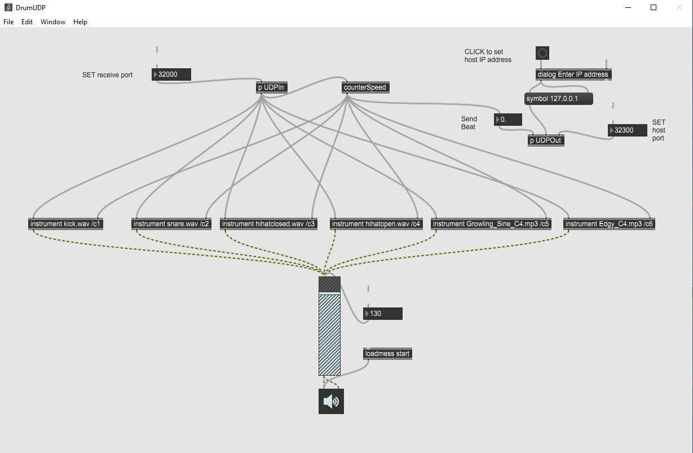

Semana 14
===========
Desde la semana pasada comenzamos a estudiar los servicios de entrada/salida
que ofrece el sistema operativo. En particular, vimos como almacenar permanentemente
información en un disco duro mediante el uso de archivos, así mismo, vimos
como es posible organizar múltiples archivos por medio de un sistema de archivos.

La metodología para abordar lo anterior se ha basado en retos de programación. En 
`este enlace <https://docs.microsoft.com/en-us/dotnet/csharp/programming-guide/file-system/>`__
puede observar algunas soluciones a los retos de la semana pasada.

Para esta semana, vamos a proponer un nuevo reto de operaciones de entrada/salida, pero esta
vez usando las capacidades de comunicación en red que le permiten a múltiples procesos comunicarse.
Dichos procesos, pueden o no estar en el mismo computador o sistema operativo.

RETO
----------
El reto se trata de controlar una aplicación de manera remota usando las capacidades de
comunicación en red que ofrece el sistema operativo. Vamos a utilizar el protocolo
de transporte UDP (User Datagram Protocol) y sobre este el protocolo de aplicación
OSC (Open Sound Control).

La aplicación que vamos a controlar la podemos descargar de
`aquí <https://drive.google.com/file/d/1LLJfyRqEqSUJTiyDfAaJ70BJUM64Gdbn/view?usp=sharing>`__

El reto consisten entonces en realizar una aplicación en Unity que permita hacer
el control remoto mediante el intercambio de mensajes OSC.

La siguiente figura muestra la imagen de la aplicación a controlar

Y esta otra figura muestra la interfaz de usuario de una aplicación ejemplo que hará el control
remoto de la anterior:

.. image:: ../_static/drumoUdpController.jpg
   :scale: 80%
   :align: center

Material de estudio
--------------------
* Clase UDP de C#: `aquí <https://docs.microsoft.com/en-us/dotnet/api/system.net.sockets.udpclient?view=netframework-4.7.2>`__.
* Protocolo de comunicación OSC: `aquí <http://opensoundcontrol.org/spec-1_0>`__.

Ejemplos de tramas OSC
-----------------------

* play:

    .. code-block:: csharp
       :lineno-start: 1

       "play\x00\x00\x00\x00,i\x00\x00\x00\x00\x00\x01"

* stop:

    .. code-block:: csharp
       :lineno-start: 1

       "play\x00\x00\x00\x00,i\x00\x00\x00\x00\x00\x00"

* Activar el beat 5 del instrumento 2:

    .. code-block:: csharp
       :lineno-start: 1

       "c\x02\x00\x00,ii\x00\x00\x00\x00\x05\x00\x00\x00\x01"

* Desactivar el beat 5 del instrumento 2:

    .. code-block:: csharp
       :lineno-start: 1

       "c\x02\x00\x00,ii\x00\x00\x00\x00\x05\x00\x00\x00\x00"

* Desactivar todos los beats del instrumento 1

    .. code-block:: csharp
       :lineno-start: 1

       "c\x01\x00\x00,ii\x00\x00\x00\x00\x11\x00\x00\x00\x00"

* Cambiar la velocidad del beat a 100. El rango está de 100 a 300.

    .. code-block:: csharp
       :lineno-start: 1

       "speed\x00\x00\x00,i\x00\x00\x00\x00\x00\x64"

* Trama enviada para la aplicación remota indicando que está
  reproduciendo el beat 16:

    .. code-block:: csharp
       :lineno-start: 1
       
       63 6f 75 6e 74 65 72 00 2c 69 00 00 00 00 00 10

Programas para realizar pruebas:
---------------------------------

* `Hercules <https://www.hw-group.com/software/hercules-setup-utility>`__.
* `Scriptcommunicator <https://sourceforge.net/projects/scriptcommunicator/>`__.

Tramas de prueba para Hercules:

.. code-block:: csharp
   :lineno-start: 1

   Activar el beat 1 del instrumento 1: c1$00$00,ii$00$00$00$00$01$00$00$00$01

   Stop: play$00$00$00$00,i$00$00$00$00$00$00

   Play: play$00$00$00$00,i$00$00$00$00$00$01

.. image:: ../_static/herculesTest.jpg
   :scale: 80%
   :align: center

