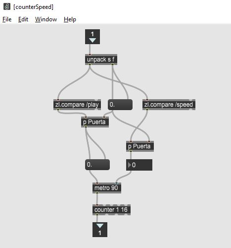

Semana 14
===========
Desde la semana pasada comenzamos a estudiar los servicios de entrada/salida
que ofrece el sistema operativo. En particular, vimos como almacenar permanentemente
información en un disco duro mediante el uso de archivos, así mismo, vimos
como es posible organizar múltiples archivos por medio de un sistema de archivos.

La metodología para abordar lo anterior se ha basado en retos de programación. En 
`este enlace <https://docs.microsoft.com/en-us/dotnet/csharp/programming-guide/file-system/>`__
puede observar algunas soluciones a los retos de la semana pasada.

Para esta semana, vamos a proponer un nuevo reto de operaciones de entrada/salida, pero esta
vez usando las capacidades de comunicación en red que le permiten a múltiples procesos comunicarse.
Dichos procesos, pueden o no estar en el mismo computador o sistema operativo.

RETO
----------
El reto se trata de controlar una aplicación de manera remota usando las capacidades de
comunicación en red que ofrece el sistema operativo. Vamos a utilizar el protocolo
de transporte UDP (User Datagram Protocol) y el protocolo de aplicación
OSC (Open Sound Control).

La aplicación que vamos a controlar la podemos descargar de
`aquí <https://drive.google.com/file/d/1LLJfyRqEqSUJTiyDfAaJ70BJUM64Gdbn/view?usp=sharing>`__

El reto consisten entonces en realizar una aplicación en Unity que permita hacer
el control remoto mediante el intercambio de mensajes OSC.

Las siguientes figuras muestran la aplicación a controlar:

.. image:: ../_static/drumMachine.jpg
   :scale: 80%
   :align: center

Y esta otra figura muestra la interfaz de usuario de una aplicación ejemplo que hará el control
remoto de la anterior (ESTA es la que ustedes deben hacer):

Material de estudio
--------------------
* Clase UDP de C#: `aquí <https://docs.microsoft.com/en-us/dotnet/api/system.net.sockets.udpclient?view=netframework-4.7.2>`__.
* Protocolo de comunicación OSC: `aquí <http://opensoundcontrol.org/spec-1_0>`__.

Ejemplos de paquetes OSC
------------------------
En `este <http://opensoundcontrol.org/spec-1_0-examples>`__
enlace se pueden ver algunos ejemplos de paquetes OSC.

Para entender la estructura de los paquetes OSC tenga en cuenta las siguientes consideraciones
de la especificación OSC 1.0:

* La comunicación en OSC se da por intercambio de paquetes.
* La aplicación que recibe paquetes se denomina servidor o SERVER
  y quien envía los paquetes cliente o CLIENT.
* Todos los paquetes en OSC deben ser múltiplos de 4 bytes.
* Los paquetes en OSC pueden ser MENSAJES o BUNDLES. Para el reto
  usaremos solo MENSAJES.
* Los OSC-MESSAGES tienen la siguiente estructura: OSC ADDRESS PATTERN + OSC TYPE TAG STRING + 0 o MÁS OSC ARGUMENTS
* OSC ADDRESS PATTERN: son OSC-STRINGS que comienzan por este carácter: /
* OSC TYPE TAG STRING: son OSC-STRINGS que comienzan por el carácter: ,
  y luego por tags que pueden ser: i f s b. Donde i indica que el mensaje
  tendrá un argumento entero, f un argumento en punto flotante, s una
  cadena y b un blob.
* Los tipos de argumentos o ATOMIC DATA TYPES son:

  int32: entero de 32 bits signado y en big-endian

  float32: número en punto flotante de 32 bits en formato 
  `IEEE 754 <https://www.h-schmidt.net/FloatConverter/IEEE754.html>`__
  en big-endian

  osc-string: cadena de caracteres ascii terminada con el carácter NULL 
  y 0 o 3 carácter NULL adicionales para lograr que la cadena sea múltiplo
  de 4 bytes o 32 bits.
 
  osc-blob y osc-time-tag, no los trabajeremos en este reto.

* Semántica de OSC: cada mensaje recibido por un servidor es potencialmente
  un llamado a un procedimiento cuyos argumentos serán los argumentos del
  mensaje.

Supanga que queremos enviar un mensaje con el siguiente OSC ADDRESS PATTERN:
\\"/oscillator/4/frequency\\" y como argumento un número en punto flotante dado
por 440.0. El paquete será así (entre paréntesis el carácter ascii
correspondiente)

2f (/)  6f (o)  73 (s)  63 (c)

69 (i)  6c (l)  6c (l)  61 (a)
 
74 (t)  6f (o)  72 (r)  2f (/)
 
34 (4)  2f (/)  66 (f)  72 (r)
 
65 (e)  71 (q)  75 (u)  65 (e)
 
6e (n)  63 (c)  79 (y)  0 ()
 
2c (,)  66 (f)  0 ()    0 ()
 
43 (C)  dc (Ü)  0 ()    0 ()

OSC ADDRESS PATTERN: \\"/oscillator/4/frequency\\"
Será una secuencia de caracteres ASCII terminados con NULL más 0 bytes NULL
porque la cantidad de bytes sería múltiplo de 4:

2f (/)  6f (o)  73 (s)  63 (c)

69 (i)  6c (l)  6c (l)  61 (a)
 
74 (t)  6f (o)  72 (r)  2f (/)
 
34 (4)  2f (/)  66 (f)  72 (r)
 
65 (e)  71 (q)  75 (u)  65 (e)
 
6e (n)  63 (c)  79 (y)  0 ()

OSC TYPE TAG STRING: \\",f\\":
2c (,)  66 (f)  0 ()    0 ()

Como tenemos solo un argumento, tendremos solo un TAG de
tipo f. La cadena termina con un carácter NULL y solo debemos adicionar
un carácter NULL para hacer OSC TYPE TAG STRING múltiplo de 4.

Finalmente el número 440.0 en formato IEEE 754 en big-endian será:

43 (C)  dc (Ü)  0 ()    0 ()

Ejemplos de paquetes OSC para nuestra aplicación
-------------------------------------------------

* play:

    .. code-block:: csharp
       :lineno-start: 1

       "/play\x00\x00\x00,i\x00\x00\x00\x00\x00\x01"

* stop:

    .. code-block:: csharp
       :lineno-start: 1

       "/play\x00\x00\x00,i\x00\x00\x00\x00\x00\x00"

* Activar el beat 5 del instrumento 2:

    .. code-block:: csharp
       :lineno-start: 1

       "/c\x02\x00,ii\x00\x00\x00\x00\x05\x00\x00\x00\x01"

* Desactivar el beat 5 del instrumento 2:

    .. code-block:: csharp
       :lineno-start: 1

       "/c\x02\x00,ii\x00\x00\x00\x00\x05\x00\x00\x00\x00"

* Desactivar todos los beats del instrumento 1

    .. code-block:: csharp
       :lineno-start: 1

       "/c\x01\x00,ii\x00\x00\x00\x00\x11\x00\x00\x00\x00"

* Cambiar la velocidad del beat a 100. El rango está de 100 a 300.

    .. code-block:: csharp
       :lineno-start: 1

       "/speed\x00\x00,i\x00\x00\x00\x00\x00\x64"

* Trama enviada para la aplicación remota indicando que está
  reproduciendo el beat 16:

    .. code-block:: csharp
       :lineno-start: 1
       
       2F 63 6f 75 6e 74 65 72 00 00 00 00 2c 69 00 00 00 00 00 10

Programas para realizar pruebas
---------------------------------

* `Hercules <https://www.hw-group.com/software/hercules-setup-utility>`__.
* `Scriptcommunicator <https://sourceforge.net/projects/scriptcommunicator/>`__.

Tramas de prueba para Hercules:

.. code-block:: csharp
   :lineno-start: 1

   //Activar el beat 1 del instrumento 1: /c1$00,ii$00$00$00$00$01$00$00$00$01

   //Stop: /play$00$00$00,i$00$00$00$00$00$00

   //Play: /play$00$00$00,i$00$00$00$00$00$01

En la siguiente imagen se observa cómo se ingresan estos comandos en el simulador:

