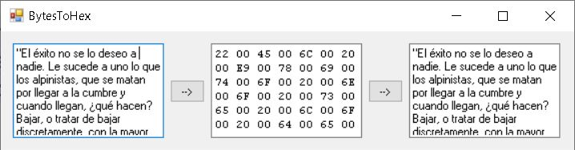

Semana 8
===========

La semana pasada terminamos la primera parte del curso
que aborda los aspecto básicos de hardware de un computador.
Construimos una CPU funcional incluyendo en su mapa de memoria
RAM y periféricos. Adicionalmente, programamos en lenguaje
en ensamblador dicho computador.

En la segunda parte parte del curso, la cual comenzaremos,
desde esta semana, abordaremos los conceptos de software
que habilitan el funcionamiento de los lenguajes de alto
nivel para realización de aplicaciones.

Esta semana comenzaremos con un repaso de C#. Utilizaremos
este lenguaje para explorar los conceptos que vienen y para
realizar los ejercicios propuestos.

La metodología que utilizaremos en esta segunda parte del
curso se basa en retos.

Reto 1:
---------
Este reto consiste en construir un programa similar al que se
muestra en la siguiente figura:

El primer botón convierte el texto de la caja de texto izquierda
en datos Unicode visualizados en hexadecimal.

El segundo botón lee la representación en hexadecimal y la
convierte de nuevo a texto.

Cree una clase estática llama Conversiones. En esta clase construya
métodos que permitan:

* Convertir cadenas de caracteres a arreglos de bytes en formato Unicode.
* Convertir arreglos de bytes con datos Unicode a cadenas de caracteres.
* Convertir un arreglo de bytes a cadenas de caracteres que muestren
  el contenido de cada byte en hexadecimal.
* Convertir cadenas hexadecimales de caracteres a arreglos de bytes.

Por último, utilice la clase anterior para construir la aplicación
propuesta.

Para resolver el problema utilice como referencia las siguientes clases:

* UnicodeEncoding
* BitConverter
* Convert

Utilice visual studio para crear una aplicación de tipo Windows Desktop,
Windows Forms App (.NET Framework).

Reto 2
--------
Repita el proyecto anterior, solo que esta vez escriba la clase estática
Conversion usando `Extension Methods <https://docs.microsoft.com/en-us/dotnet/csharp/programming-guide/classes-and-structs/extension-methods>`__.

Reto 3
--------
Realice un programa que permita:

* Leer el contenido de un programa .asm.
* Convertir el programa a lenguaje de máquina .hack.
* Visualizar el programa .hack.
* Salvar el archivo .hack.
* Si no es posible hacer la conversión de una línea
  del archivo asm, deben marcar la línea de color rojo e
  indicar cuál es el posible error.

Para este reto puede utilizar la información contenida en el capítulo 6
del texto guía correspondiente al `proyecto 6 <https://www.nand2tetris.org/project06>`__
