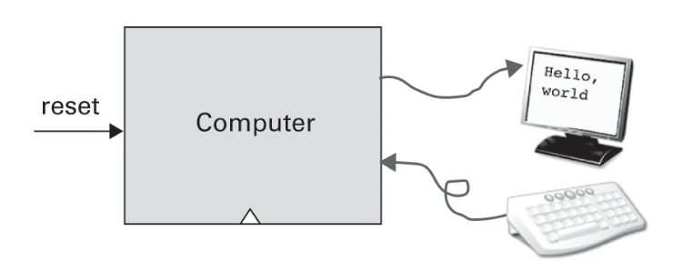
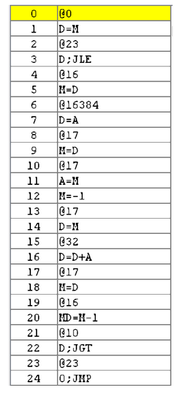

Unidad 1. Arquitectura del computador
=======================================

Introducción
--------------

En esta unidad vas a aprender los bloques de construcción
básicos del hardware de un sistema de cómputo moderno y cómo 
esos bloques pueden combinarse para construir computadores.

Propósito de aprendizaje
^^^^^^^^^^^^^^^^^^^^^^^^^^

Comprender cómo funciona el hardware de un computador moderno 
desde una perspectiva sistémica, es decir, estudiando las partes 
que lo componen y cómo conectarlas entre ellas para conseguir funciones 
cada vez más complejas.

¿Cómo lo haremos? Emprendiendo una de las aventuras más interesantes: construyendo 
un computador.

Temas
^^^^^^

* Compuertas lógicas
* Circuito lógicos y aritméticos: ALU
* Memorias y registros.
* Lenguaje de máquina
* Arquitectura del computador
* Lenguaje ensamblador

Actividades
------------------------

Lectura 1
^^^^^^^^^^^^

Todos tenemos una imagen clara de lo que es un computador. De hecho somos usuarios 
de ellos en nuestro día a día. En últimas un computador es una máquina 
que lee datos, los procesa y los almacena y/o los presenta de alguna manera. 
La manera como serán procesados los datos es codificada como un conjunto de instrucciones 
que denominamos programas. 

Una de la partes fundamentales de un computador es la unidad de procesamiento central 
o Central Processing Unit (CPU). Este componente se encarga de leer, entender y ejecutar 
las instrucciones que componen los programas. Otra de las partes esenciales es la memoria. 
En ella se almacenan las instrucciones, así como los datos que estas manipulan. En 
este curso vamos a concentrarnos particularmente en la construcción de estas dos partes; 
sin embargo, el resultado final será un computador como el que se muestra en la siguiente 
imagen:

Por facilidad, toda la construcción la vamos a realizar de manera virtual, es decir,
vamos a simular cada una de las partes que componen el sistema de cómputo; no obstante, 
las herramientas y procesos que usaremos son muy similares a los que se usan 
en la industria y con un poco más de esfuerzo incluso podríamos llegar a una implementación 
física.

Lectura 2
^^^^^^^^^^^^
Para realizar la construcción de la CPU y la memoria vamos a necesitar un LENGUAJE 
especial que nos permita describir las partes de un componente y cómo esas 
partes se conectan entre ellas para lograr la funcionalidad deseada. El lenguaje 
que vamos a utilizar será HDL o lenguaje de descripción de hardware, el cual es una 
versión MUY simplificada de los lenguajes que se usan en la industria.

.. warning:: 
    Material complementario 1

    Si te gusta un poco la historia te voy a recomendar que veas 
    `este <https://youtube.com/playlist?list=PL1331A4548513EA81>`__ documental 
    de la BBC donde podrás observar una historia de los computadores.

Lectura 3
^^^^^^^^^^^^
La CPU y la memoria están construidas de `circuitos integrados <https://en.wikipedia.org/wiki/Integrated_circuit>`__ 
que llamaremos chips. Por tanto, lo que realmente haremos en este curso es implementar 
algunos chips y luego los conectaremos con otros para obtener el PREMIO: la computadora.

Alguna vez te has preguntado ¿Cómo se implementa y construye un chip?

Pues se parte de un diseño que se describe mediante algún lenguaje de descripción 
de hardware, como por ejemplo, el que puedes observar en la imagen:

Luego este diseño debe descomponerse en partes más simples. Esas partes se denominan 
`transistores <https://en.wikipedia.org/wiki/Transistor>`__:

.. image:: ../_static/transistor.png
    :alt: transistor

Finalmente, los transistores y sus conexiones se deben transferir
a un medio físico. Esto se hace mediante un proceso conocido como
fotolitografía:

.. raw:: html

    

        <iframe width="560" height="315" src="https://www.youtube.com/embed/vK-geBYygXo" frameborder="0" allow="accelerometer; autoplay; encrypted-media; gyroscope; picture-in-picture" allowfullscreen></iframe>
    

.. warning:: 
    Material complementario 2

    ¿Cómo funciona un transistor? 

.. raw:: html
    
    

        <iframe width="560" height="315" src="https://www.youtube.com/embed/tz62t-q_KEc" frameborder="0" allow="accelerometer; autoplay; encrypted-media; gyroscope; picture-in-picture" allowfullscreen></iframe>
    

Lectura 4
^^^^^^^^^^^^
En resumen, en este curso vamos a construir un computador conectando 
múltiples chips. Algunos chips los vamos a construir nosotros, mientras que 
otros simplemente los tomaremos ya listos.

Para implementar un chip emplearemos un lenguaje de descripción de hardware 
que indique qué partes tendrá el chip y cómo estas se conectan.

La implementación será simulada.

En este viaje no vamos a partir de cero. Vamos a iniciar con un chip ya listo 
para ser usado que se denomina compuerta NAND. A partir de este chip vamos 
a implementar otros, inicialmente simples, pero que luego iremos conectando 
entre ellos para lograr funcionalidades cada vez más complejas hasta llegar 
a un computador.

Lectura 5
^^^^^^^^^^^^
Lee el `capítulo 1 del libro guía <https://docs.wixstatic.com/ugd/44046b_f2c9e41f0b204a34ab78be0ae4953128.pdf>`__

Ejercicio 1
^^^^^^^^^^^^
En tu bitácora de trabajo responde las siguientes preguntas:

#. ¿Qué es una compuerta lógica (logic gate)?
#. Dibuja los símbolos de las compuertas NAND, NOT, OR, AND, XOR
#. ¿Qué es una función booleana?
#. Escribe la tabla de verdad de las funciones booleanas NOT, AND, OR, NAND y XOR.
#. ¿Qué relación hay entre una compuerta lógica y una función booleana?
#. ¿Cómo podrías conseguir una compuerta NAND a partir de una compuerta NOT y una compuerta AND?
#. ¿Qué tiene de especial el conjunto de compuertas {AND,NOT,OR}?
#. ¿Qué tiene de especial la compuerta NAND?
#. ¿Cuántas filas tiene la tabla de verdad de una función booleana?
#. Muestra un ejemplo de una función booleana deducida a partir de una tabla de verdad
#. Dibuja cómo sería una compuerta OR de 4 entradas usando solo compuertas OR de 2 entradas

Ejercicio 2
^^^^^^^^^^^^
Para implementar los chips del computador vas a utilizar un programa que te permitirá
verificar la implementación y simular su comportamiento.

Ingresa a `este <https://www.nand2tetris.org/software>`__ sitio. Sigue las instrucciones
de descarga. Ten presente que vas a necesitar preparar tu computador para poder ejecutar 
el simulador. Todos los requisitos están en la página anterior.

Si has seguido las instrucciones correctamente, debes tener la máquina virtual de java 
instalada en tu computador. Lo puedes verificar ejecutando en una terminal o símbolo del sistema 
el comando

.. code-block:: bash

    java --version

Si el sistema reconoce el comando vas por buen camino.

Una vez descargues el archivo nand2tetris.zip, lo DEBES descomprimir. Verás dos carpetas, 
una que dice projects y la otra dirá tools.

Ingresa a la carpeta tools u ejecuta el archivo HardwareSimulator.bat. Si todo está bien 
deberías ver una ventana similar a esta:

Lectura 6
^^^^^^^^^^^^

Lee las `instrucciones <https://b1391bd6-da3d-477d-8c01-38cdf774495a.filesusr.com/ugd/44046b_bfd91435260748439493a60a8044ade6.pdf>`__ 
de uso del software.

PROYECTO FORMATIVO 1
^^^^^^^^^^^^^^^^^^^^^

Realiza el primer proyecto de esta unidad que puedes encontrar `aquí <https://www.nand2tetris.org/project01>`__

En tu bitácora puedes documentar el diagrama de compuertas de cada circuito.

.. warning::
    CONTROL DE VERSIÓN

    Desde el inicio del proyecto debes crear un repositorio y realizar commits periódicamente. Tu repositorio 
    debe mostrar el proceso de trabajo.

Lectura 7
^^^^^^^^^^^^

Con esta lectura vas a responder unas preguntas fundamentales. ¿Cómo se almacenan los número 
enteros en un computador? ¿Y si son negativos? ¿Cómo hace un computador para realizar 
operaciones aritméticas?

Lee el `capítulo 2 del libro guía <https://docs.wixstatic.com/ugd/44046b_b0b50efb68ac4f0da19383ec064977b1.pdf>`__.

Ejercicio 3
^^^^^^^^^^^^
En tu bitácora de trabajo responde las siguientes preguntas:

#. ¿Cómo se llama el componente de una CPU encargado de realizar las operaciones aritméticos y lógicos?
#. Realiza una tabla con la representación en base dos de los números del 0 al 15.
#. ¿Cuáles son los tamaños típicos en bits con los cuales se representan en un computador números enteros?
#. ¿Cuántos números enteros positivos se pueden representar con 8 bits?
#. ¿Cuántos número enteros positivos se pueden representar con n bits? 
#. Realiza una tabla donde muestres los números positivos y negativos que puedes representar en complemento a 2 con 4 bits.
#. ¿Cómo es el -1 en complemento a dos con 4,8,16,32 bits? ¿Qué puedes concluir?
#. Con n bits ¿Cuál es el rango de número positivos y negativos que puedes representar?
#. Si tienes 4 bits que representan números en complemento a dos. ¿Qué pasa si sumas 7 + 1?  

PROYECTO FORMATIVO 2
^^^^^^^^^^^^^^^^^^^^^^^

Realiza el proyecto 2 que encuentras `aquí <https://www.nand2tetris.org/project02>`__.

En tu bitácora puedes incluir el diagrama de compuertas de cada circuito.

.. warning::
    CONTROL DE VERSIÓN

    Desde el inicio del proyecto debes crear un repositorio y realizar commits periódicamente. Tu repositorio 
    debe mostrar el proceso de trabajo.

Lectura 8
^^^^^^^^^^^^

Lee el `capítulo 3 del libro guía <https://b1391bd6-da3d-477d-8c01-38cdf774495a.filesusr.com/ugd/44046b_862828b3a3464a809cda6f44d9ad2ec9.pdf>`__.

Ejercicio 4
^^^^^^^^^^^^
En tu bitácora de trabajo responde las siguientes preguntas:

#. ¿Cómo funciona un flip-flop tipo D o data?
#. Dibuja el diagrama general de un circuito lógica secuencial. Explica cómo funciona.

PROYECTO FORMATIVO 3
^^^^^^^^^^^^^^^^^^^^^

Realiza el proyecto 3 que encuentras `aquí <https://www.nand2tetris.org/project03>`__

En tu bitácora puedes incluir el diagrama de compuertas de cada circuito.

.. warning::
    CONTROL DE VERSIÓN

    Desde el inicio del proyecto debes crear un repositorio y realizar commits periódicamente. Tu repositorio 
    debe mostrar el proceso de trabajo.

Lectura 9
^^^^^^^^^^^^

Lee el `capítulo 4 del libro guía <https://b1391bd6-da3d-477d-8c01-38cdf774495a.filesusr.com/ugd/44046b_7ef1c00a714c46768f08c459a6cab45a.pdf>`__.

Ejercicio 5
^^^^^^^^^^^^
En tu bitácora de trabajo responde las siguientes preguntas:

#. Muestra una instrucción tipo A en representación simbólica y en lenguaje de máquina. Explica qué hace esta instrucción.
#. Muestra una instrucción tipo C en representación simbólica y en lenguaje de máquina. Explica qué hace esta instrucción.
#. En el lenguaje hack ¿Qué son los símbolos? muestra varios ejemplos de estos.
#. ¿Qué son los labels? ¿Para qué sirven? ¿En que se diferencian de los símbolos?

Lectura 10 (con ejercicio)
^^^^^^^^^^^^^^^^^^^^^^^^^^^^
Par el siguiente proyecto vas a necesitar un programa diferente. En este caso, un 
emulador de CPU. Lee las `instrucciones <https://b1391bd6-da3d-477d-8c01-38cdf774495a.filesusr.com/ugd/44046b_f63aba2611944e82974c9c5d5a3821fe.pdf>`__ 
de uso del software.

Analiza los 3 ejemplos de programación de hack (sección 4.3 edición 2, habla con el profe). Simula cada programa.

PROYECTO FORMATIVO 4
^^^^^^^^^^^^^^^^^^^^^^

Realiza el proyecto 4 que encuentras `aquí <https://www.nand2tetris.org/project04>`__

En tu bitácora puedes incluir el diagramas de flujo para cada programa.

.. warning::
    CONTROL DE VERSIÓN

    Desde el inicio del proyecto debes crear un repositorio y realizar commits periódicamente. Tu repositorio 
    debe mostrar el proceso de trabajo.

Lectura 11
^^^^^^^^^^^^

Lee el `capítulo 5 del libro guía <https://b1391bd6-da3d-477d-8c01-38cdf774495a.filesusr.com/ugd/44046b_b2cad2eea33847869b86c541683551a7.pdf>`__.

Ejercicio 6
^^^^^^^^^^^^
En tu bitácora de trabajo responde las siguientes preguntas:

#. Explica con tus propias palabras en qué consiste el concepto de programa almacenado.
#. ¿Por qué es importante el concepto de programa almacenado? ¿Qué ventaja tiene frente a las primeras computadoras?
#. Explica en qué cosiste la arquitectura con Neumann.
#. ¿Cuál es la diferencia entre la memoria de datos y la memoria de instrucciones?
#. ¿Cuáles son los elementos básicos de una CPU? ¿Qué función cumple cada uno?
#. Explica con tus propias palabras en qué cosiste el concepto de dispositivos de entrada salida mapeados a memoria.

PROYECTO EVALUATIVO DE LA UNIDAD 
^^^^^^^^^^^^^^^^^^^^^^^^^^^^^^^^^

Enunciado de la evaluación
############################

Analiza detenidamente y responde las siguientes preguntas:

Pregunta 1
************

Considerando esta implementación de la CPU:

.. code-block:: c

    CHIP CPU {

        IN  inM[16],         // M value input  (M = contents of RAM[A])
            instruction[16], // Instruction for execution
            reset;           // Signals whether to re-start the current
                            // program (reset=1) or continue executing
                            // the current program (reset=0).

        OUT outM[16],        // M value output
            writeM,          // Write into M? 
            addressM[15],    // Address in data memory (of M)
            pc[15];          // address of next instruction

        PARTS:
        // Implementation by Mark Armbrust.

        // Instruction decode
        Not (in=instruction[15], out=aInst);
        And (a=instruction[14], b=instruction[13], out=ones);
        And (a=ones,  b=instruction[15], out=cInst);
        And (a=cInst, b=instruction[12], out=srcM);
        And (a=cInst, b=instruction[11], out=aluZx);
        And (a=cInst, b=instruction[10], out=aluNx);
        And (a=cInst, b=instruction[9],  out=aluZy);
        And (a=cInst, b=instruction[8],  out=aluNy);
        And (a=cInst, b=instruction[7],  out=aluF);
        And (a=cInst, b=instruction[6],  out=aluNo);
        And (a=cInst, b=instruction[5],  out=destA);
        And (a=cInst, b=instruction[4],  out=destD);
        And (a=cInst, b=instruction[3],  out=writeM);   // destM
        And (a=cInst, b=instruction[2],  out=jmpLt);
        And (a=cInst, b=instruction[1],  out=jmpEq);
        And (a=cInst, b=instruction[0],  out=jmpGt);

        // A register and input mux
        Mux16 (sel=aInst, a=aluOut, b=instruction, out=aIn);
        Or (a=aInst, b=destA, out=loadA);
        ARegister (in=aIn, load=loadA, out=aReg, out[0..14]=addressM);
        
        // D register
        DRegister(in=aluOut, load=destD, out=dReg);

        // ALU and input mux
        Mux16 (sel=srcM, a=aReg, b=inM, out=aluY); 
        ALU (x=dReg, y=aluY, out=aluOut, out=outM, zr=aluZr, ng=aluNg,
                zx=aluZx, nx=aluNx, zy=aluZy, ny=aluNy, f=aluF, no=aluNo);

        // PC with jump test
        Or (a=aluZr, b=aluNg, out=zrng);
        Not (in=zrng, out=aluPos);
        And (a=aluNg, b=jmpLt, out=jlt);
        And (a=aluZr, b=jmpEq, out=jeq);
        And (a=aluPos, b=jmpGt, out=jgt);
        Or (a=jlt, b=jeq, out=jle);
        Or (a=jle, b=jgt, out=jmp);
        PC (in=aReg, reset=reset, inc=true, load=jmp, out[0..14]=pc);
    }

Dibuja el diagrama en bloques de la CPU. Recuerda marcar detalladamente cada chip con su nombre, 
puertos y el tamaño en bits de cada puerto. COLOCA EL NOMBRE DE LOS PUERTOS Y DEL CHIP 
adentro del rectángulo que identifica el circuito. 
Esto con el fin de poder distinguir el nombre de los cables del nombre de los puertos.     

Pregunta 2
************

Considerando esta implementación del computador:

.. code-block:: c

    CHIP Computer {

        IN reset;

        PARTS:

        // CPU
        CPU (inM=RAMout, instruction=ROMout, reset=reset, writeM=loadRAM,
            outM=RAMin, addressM=RAMaddress, pc=ROMaddress);

        // RAM
        Memory (in=RAMin, load=loadRAM, address=RAMaddress, out=RAMout);

        // ROM
        ROM32K (address=ROMaddress, out=ROMout);
    }

Dibuja el diagrama en bloques del computador. Recuerda marcar detalladamente cada chip con su nombre, 
puertos y el tamaño en bits de cada puerto. COLOCA EL NOMBRE DE LOS PUERTOS Y DEL CHIP 
adentro del rectángulo que identifica el circuito. 
Esto con el fin de poder distinguir el nombre de los cables del nombre de los puertos. 

Pregunta 3
************

Explica qué hace el siguiente programa:

Muestra gráficamente qué pasa con la CPU, la memoria y los buses del computador al ejecutar cada 
una de las siguientes instrucciones: ``@16384``, ``D;JLE``, ``A=M``, ``MD = M-1``. Estas instrucciones hacen parte 
del programa que te muestré en la figura anterior y como puedes notar están ubicada en diferentes 
partes del programa. Debes tener en cuenta el estado de la CPU y la memoria como consecuencia de las 
instrucciones anteriores a la que te pido que analices.

Pregunta 4
************

Inventa una nueva instrucción para el computador de tal manera que al ejecutarla se reinicie el programa.

* Define cuál sería la sintaxis simbólica. 
* Define la sintaxis binaria.
* Realice un nuevo diagrama de la CPU donde muestre la modificación necesaria para implementar la nueva instrucción.

Pregunta 5
*************

En una implementación de la CPU (no sabemos si está correcta o no), al ejecutar esta instrucción 
``0111 1100 1001 0000`` el contenido del registro D se modifica. ¿Es esto correcto?

Muestre en el diagrama de la CPU lo que podría estar pasando en dicha implementación.

Entregables
############################

* Sube a `este <https://www.dropbox.com/request/yuejWTLm3UsZ5mdnAVVM>`__ 
  enlace un archivo pdf nombrado con los nueve dígitos que componen tu ID. Por ejemplo: 000008716.pdf. El archivo 
  debe tener lo siguiente:

  * Tu nombre completo.
  * Evaluación de la unidad 1 y la fecha en la cual vas subir el archivo.
  * Define una sección en el documento para solucionar cada pregunta.

.. warning:: USA DRAW.IO

    Te recomiendo usar la aplicación draw.io para realizar los diagramas solicitados.

Criterios de evaluación
############################

Estos son los puntos que te dará la solución a cada pregunta.

* Pregunta 1: 0.5
* Pregunta 2: 0.5
* Pregunta 3: 2
* Pregunta 4: 1
* Pregunta 5: 1

.. warning:: ASIGNACIÓN DE PUNTAJE

    La asignación de los puntos a la respuesta de cada pregunta se otorga 
    solo si la respuesta está completa. No se asignarán calificaciones intermedias. Por tanto,
    revisa cuidadosamente la respuesta a cada una de tus preguntas.